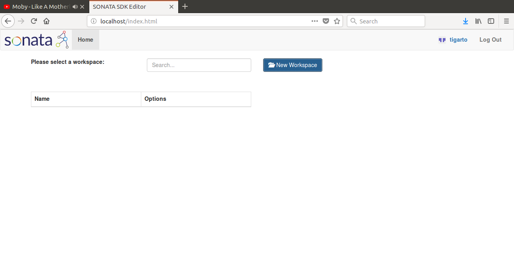

# ENSAYOS PRELIMINARES - PROCESO DE INSTALACION DE SONATA

> **Objetivos**:
> * Instalar SONATA
> * Documentar la experiencia de instalacion.
> * Hacer los test de chequeo basicos

## 1. Instalacion de SONATA

Para el proceso de instalacion se siguio el siguiente [enlace](https://github.com/sonata-nfv/son-tutorials/blob/master/docs/component_installation.md).

### 1.1. Prerequisitos
Se supone que la maquina en la cual se realizo la instalación de **SONATA** ya cumple con los prerequisitos. Como la maquiba tiene Ubuntu Xenial (16.04) virtualizado por lo cual se siguieron las instrucciones de instalacion para esta distribución.

### 1.2. Instalacion de sonata-cli

```
sudo apt-key adv --keyserver keyserver.ubuntu.com --recv-keys 8EC0731023C1F15B
echo "deb http://repo.sonata-nfv.eu ubuntu-xenial main" | sudo tee -a /etc/apt/sources.list
sudo apt-get update
sudo apt-get install sonata-cli
```

Tambien siguiendo el [video de instalacion](https://youtu.be/Hk4j3NcnB4A) para Ubuntu, se ejecutaron los siguientes comandos para verificar la correcta instalacion de la herramienta:

```
son-workspace --help
son-package --help
son-validate --help
son-access --help
son-monitor --help
```

## 2. Instalacion de SONATA's emulation platform

### 2.1. Prerequisitos
A continuacion se muestran los requerimientos que ya se cumplen en la plataforma localmente instalada:
* ansible
* aptitude
* git
* Containernet

### 2.2. Instalacion del emulador

Como los pasos 1 y 2 de la [guia](https://github.com/sonata-nfv/son-tutorials/blob/master/docs/component_installation.md) ya se cumplian solo se llevo a cabo el paso 3, a continuacion se repiten las instrucciones ejecutadas:

```
cd
git clone https://github.com/sonata-nfv/son-emu.git
cd ~/son-emu/ansible
sudo ansible-playbook -i "localhost," -c local install.yml
```

### 2.3. Instalacion del editor

Otro componente clave de sonata es el **son-editor-backend**; para mas informacion sobre este, puede consultar el siguiente [enlace](https://github.com/sonata-nfv/son-editor-backend). En dicho enlace, se encuentran las instrucciones para llevar a cabo la instalacion, conviene tener en cuenta que se debe tener la certeza de que ya se tiene **docker-compose** instalado, si no es asi puede hacerlo mediante y probar la instalacion mediante los siguientes comandos:

```
sudo pip install docker-compose
sudo docker-compose --version
sudo docker-compose --help
```

Lo que resta es seguir las instrucciones de instalacion que se dan en la [pagina](https://github.com/sonata-nfv/son-editor-backend) de son-editor.

1. Autenticarse tal y como alli se explica. Para nuestro caso:
   * Application name: SONATA Editor
   * URL of your installation: http://localhost/
   * Authentication callback URL: http://localhost/backend/login
   

**Figura 1**. Llenando los datos de autenticacion.

2. Cuando se guarda se generan dos codigos ClientID y ClientSecret los cuales de necesitan al momento de editar el archivo **config.yaml**.

3. A continuacion se muestran los comandos realizados antes de modificar el config.yaml:

```
cd $HOME
git clone https://github.com/sonata-nfv/son-editor-backend
cd son-editor-backend/
```

4. Se edita **config.yaml** con los numeros generados en 2.
5. Finalmente se ejecuta el comando:

```
sudo docker-compose up
```

6. Se habre el browser en **http://localhost/** y se procede al logeo con la cuenta de github.


**Figura 2**. Logueo.

7. Si todo sale como se espera este sera el resultado:


**Figura 3**. Interfa sonata.


