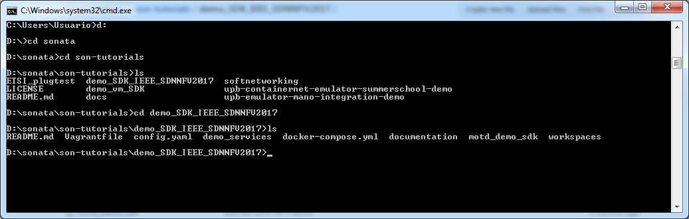
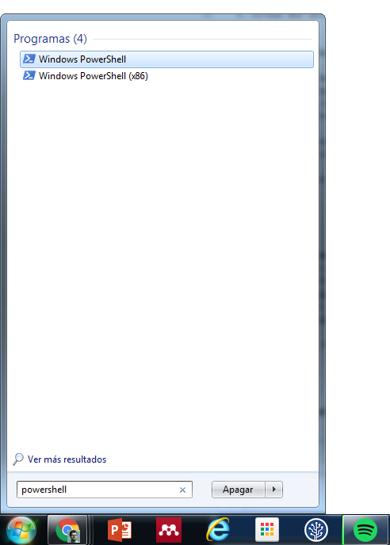
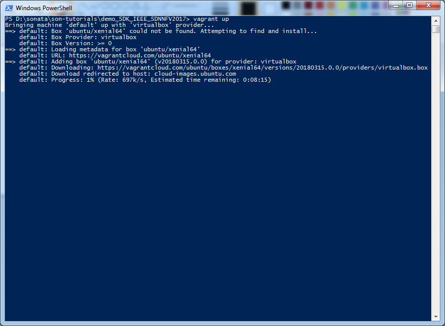
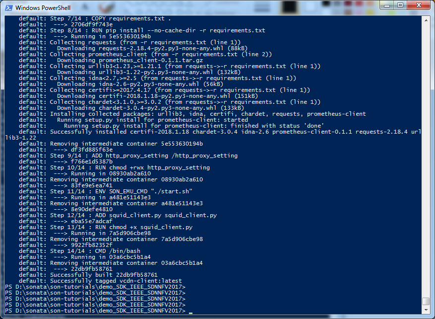
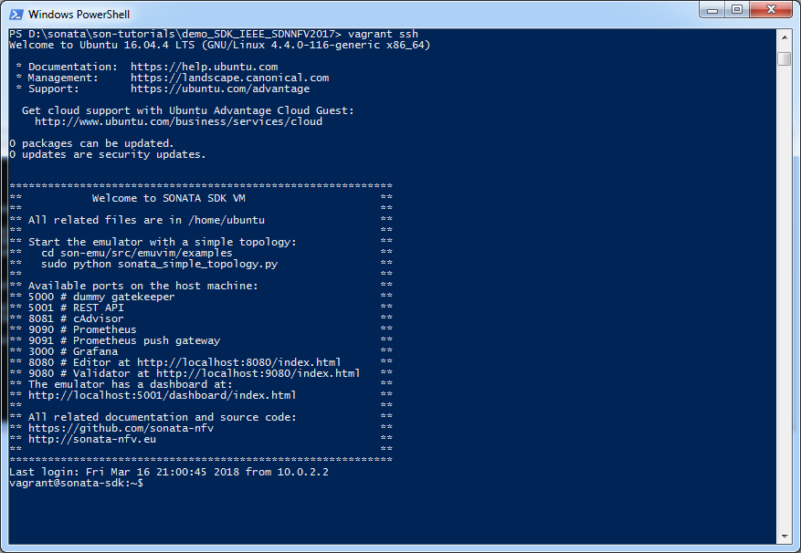
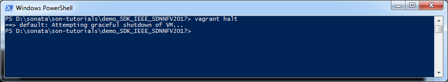

# PROCESO DE INSTALACION USANDO VAGRANT

## Caracteristicas del sistema de desarrollo

### 1. Hardware:
* Portatil Lenovo Z50
* Procesador Intel Core i7-4510U 2.00GHz 
* Memoria RAM de 8 GB DDR3 
* Disco duro de 1TB
* Tarjeta grafica NVIDIA GeForce 820M 2GB

### 2. Software:
* Sistema Operativo: Windows 7 SP1.
* Sofware de desarrollo:
  1. Virtual Box version 5.0.12
  2. Vagrant 2.0.3

## Proceso de instalacion

### 1. Descarga de los archivos necesarios
Se procedio a descargar los archivo del siguiente [repositorio](https://github.com/sonata-nfv/son-tutorials/tree/master/). El objetivo es llevar a cabo la instalacion de sonata haciendo uso de la herramienta Vagrant. Una descargada se accedio al directorio ```demo_SDK_IEEE_SDNNFV2017``` disponible en esta carpeta. 



**Figura 1**. Ubicacion en el directorio de trabajo.

Una vez alli teniendo la certeza que esta el archivo de ```Vagrantfile``` se procedio a la instalacion ejecutando el comando:

```
vagrant up
```

**Problemas encontrados en el procedimiento**: En nuestro caso, no era posible llevar a cabo la instalación debido a problemas con la consola. Buscando se encontro una posible solucion en el siguiente [foro](https://stackoverflow.com/questions/19902239/how-to-upgrade-powershell-version-from-2-0-to-3-0) asi que tal y como alli se indica se procedio a llevar a cabo la instalacion de una herramienta conocida como [Chocolatey](https://chocolatey.org/) (una especie de apt-get pero para windows) y se llevo a cabo su instalación como se detalla en la pagina. Una vez con Chocolatey instalado se procedio a la instalación del powershell tal y como se indica en el siguiente enlace(https://chocolatey.org/packages/PowerShell) de Chocolatey. Ejecutando los comandos:

```
choco install powershell
choco upgrade powershell
```

Con el powershell 5 instalado se procede a accederlo:



**Figura 2**. Abriendo el powershell.

Con esto listo se procese a seguir los pasos de instalación mostrados en el siguiente [video](https://www.youtube.com/watch?v=e6pgP-utSeE) Y una vez en el directorio previamente mencionado (donde se encuentra el ```Vagrantfile```). Para el caso, inicialmente se procede ejecutar el comando ```vagrant up``` 



**Figura 3**. Iniciando el proceso de instalación.

Se espera un rato por que como es la primera vez que se ejecuta el proceso implica la construccion de la imagen que se alojara en VirtualBox, por lo que puede irse a tomar un cafesito. Cuando regrese vera algo como lo siguiente:



**Figura 4**. Finalizando el proceso de instalación.

Solo resta acceder a la maquina por medio del comando ```vagrant ssh```



**Figura 5**. Accediendo a la maquina.

Cuando se haya trabajado lo suficiente con la maquina nos salimos de esta con ```exit```:

```vagrant@sonata-sdk:~$ exit```

Finalmente si no se va a trabajar mas con la maquina virtual la apagamos desde vagrant con el comando ```vagrant halt```



**Figura 6**. Apagando la maquina.

## Trabajando con la maquina

Todo lo que se hace despues de instalada la maquina virtual desde vagrant se reduce a 5 cosas:

1. Arranque la maquina (si esta esta apagada - esto se puede verificar en virual box). Ejecutando el comando vagrant up donde se encuentra el Vagranfile asociado a la maquina.

```
vagrant up
```

2. Acceda a la maquina mediante ssh:

```
vagrant ssh
```

3. Trabaje en la maquina, haga las tareas que necesite.

4. Cuando culmine desloguese:

```
exit
```

5. Finalmente apague la maquina virtual desde vagrant:

```
vagrant halt
```
